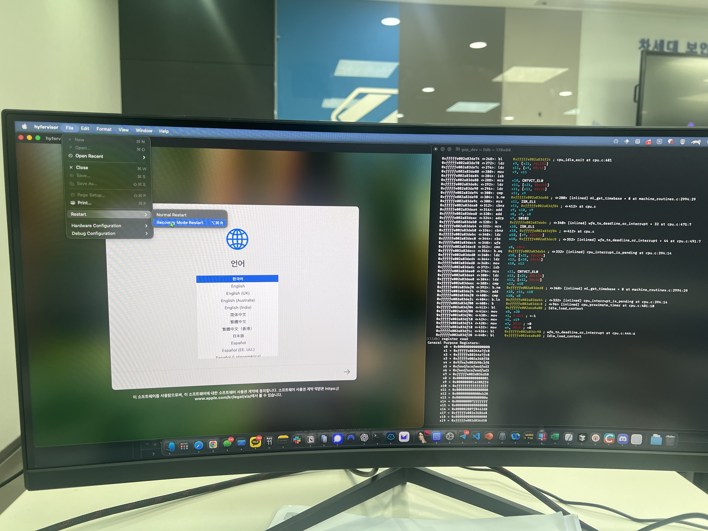

# hyfervisor - Apple Silicon Mac에서 macOS 가상머신 실행 도구

## 개요

hyfervisor는 Apple Silicon Mac에서 최신버전의 macOS kernel을 live debugging 할 수 있는 도구입니다.

## 스크린샷




## 주요 기능

- **macOS 가상머신 실행**: Apple Silicon Mac에서 macOS를 가상머신으로 실행
- **하드웨어 가상화**: CPU, 메모리, 그래픽, 네트워크, 오디오 등 다양한 하드웨어 구성 지원
- **디버그 지원**: GDB 디버그 스텁을 통한 가상머신 디버깅 기능

## 시스템 요구사항

- **하드웨어**: Apple Silicon Mac (M1, M2, M3 등)
- **운영체제**: macOS 12.0 (Monterey) 이상


## 빌드 및 실행

### 1. 의존성 확인
```bash
make check-deps
```

### 2. 전체 빌드
```bash
make all
```

### 3. 설치 도구만 빌드
```bash
make hyfervisor-InstallationTool-Objective-C
```

### 4. 앱만 빌드
```bash
make hyfervisor-Objective-C
```

### 5. 빌드 정리
```bash
make clean
```

## 사용 방법

### 1. 설치 도구 실행
```bash
# 빌드 후 실행 파일 위치
./build/Build/Products/Release/hyfervisor-InstallationTool-Objective-C
```

### 2. 메인 애플리케이션 실행
```bash
# 빌드 후 앱 실행
open build/Build/Products/Release/hyfervisor-Objective-C.app
```


## 문제 해결

### 빌드 오류
```bash
# 의존성 확인
make check-deps

# 정리 후 재빌드
make clean
make all
```

